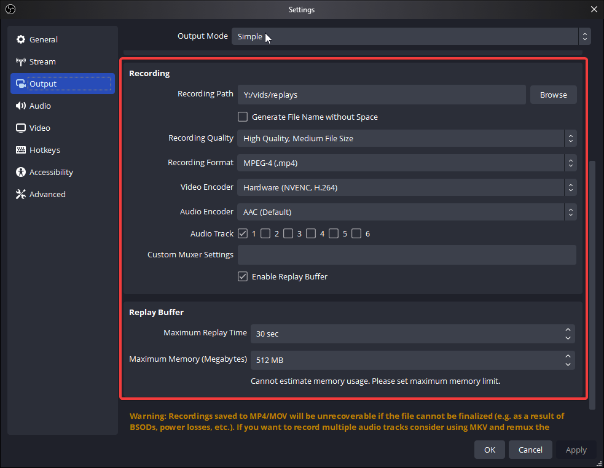

This contains some of the assets that were created for the FVF tournament.

The following files are not included because of copyright, but can be easily downloaded from the FvF soundtrack:

1. 01_Friends vs Friends (Intro)
2. 02_It's Not Personal
3. 05_Gachasong
4. 06_Buddy's Boulevard

All of these files are named the same as they are on the soundtrack.

# Setup Notes:
-----

1. Take the ZIP version of this folder, extract it somewhere on your harddrive.
2. Import the JSON file `FvF_Exportable.json` as a scene collection in OBS. All media will be pointing to the `Y:\OBSBackups\FvF` folder, but you can just redirect it.
3. The AD Overlay html source is from an internal project, you can remove it or just ask me for the overlay, and I'll send you the project (unless I eventually finish it for open source).
1. The Streammeta source should be the browser source of your streammeta overlay as given to you by the website.
2. The Credits source is just the source of a streamelements overlay. You can choose not to use it.
3. To use automation with different scenes and controllers, you must install the [Advanced Scene Switcher on OBS](https://obsproject.com/forum/resources/advanced-scene-switcher.395/). The scene profile `scene-switcher-macros.txt` can be imported. You will need to change the one macro that handles setting the data on the replay scene to point to the right folder. Same when leaving the replay source.
4. Make sure your OBS video settings are properly set for the Flashback replay recordings. You will want to make sure that you have them set like the image below. Files should be dumped into the replays folder.

